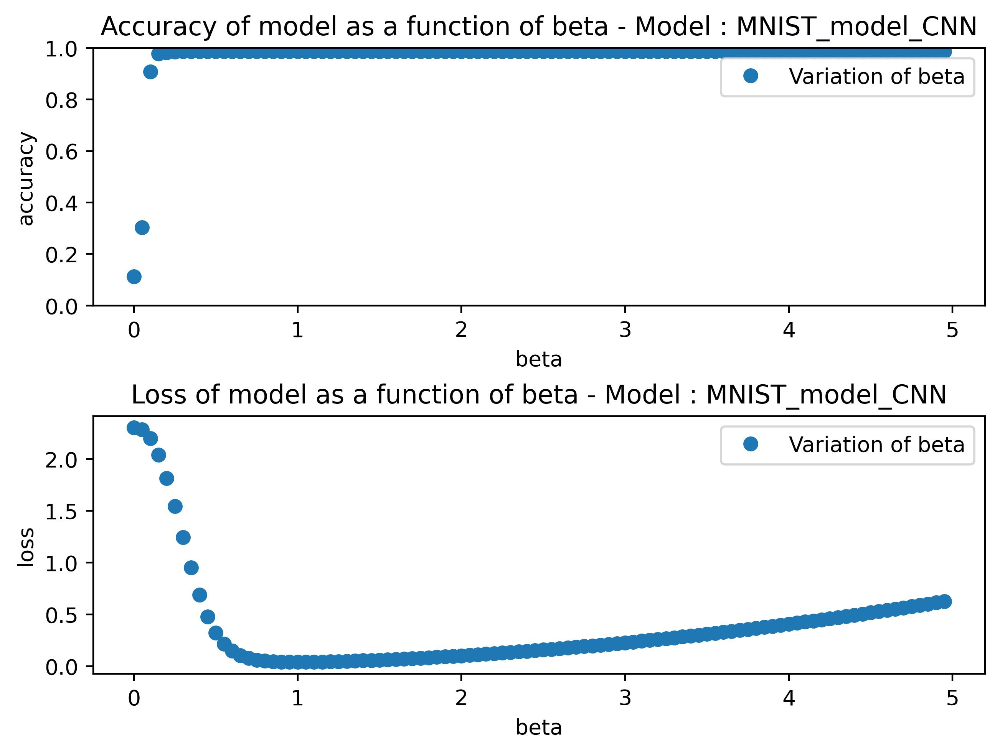
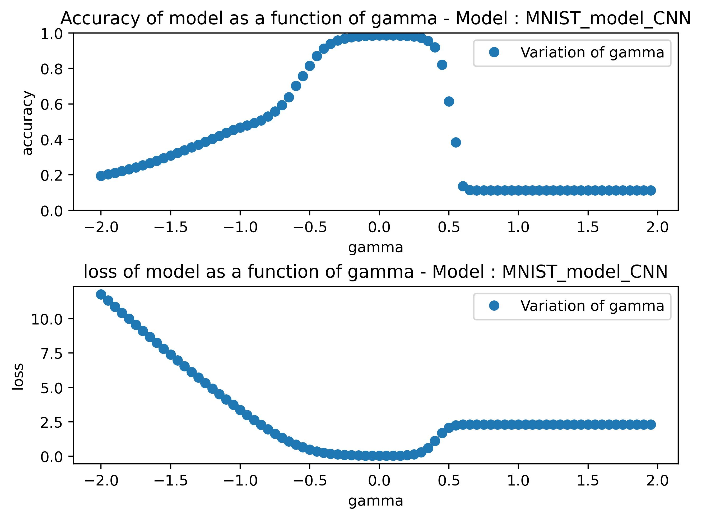
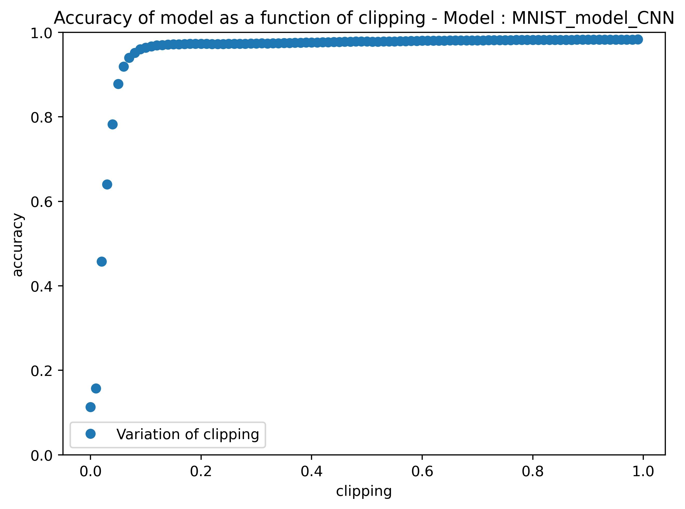
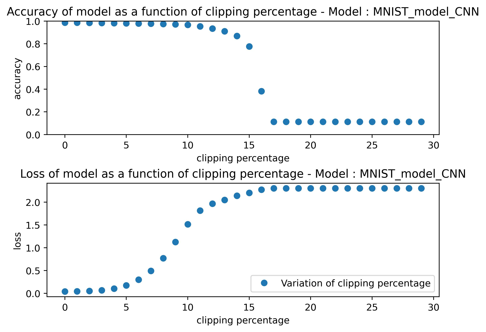
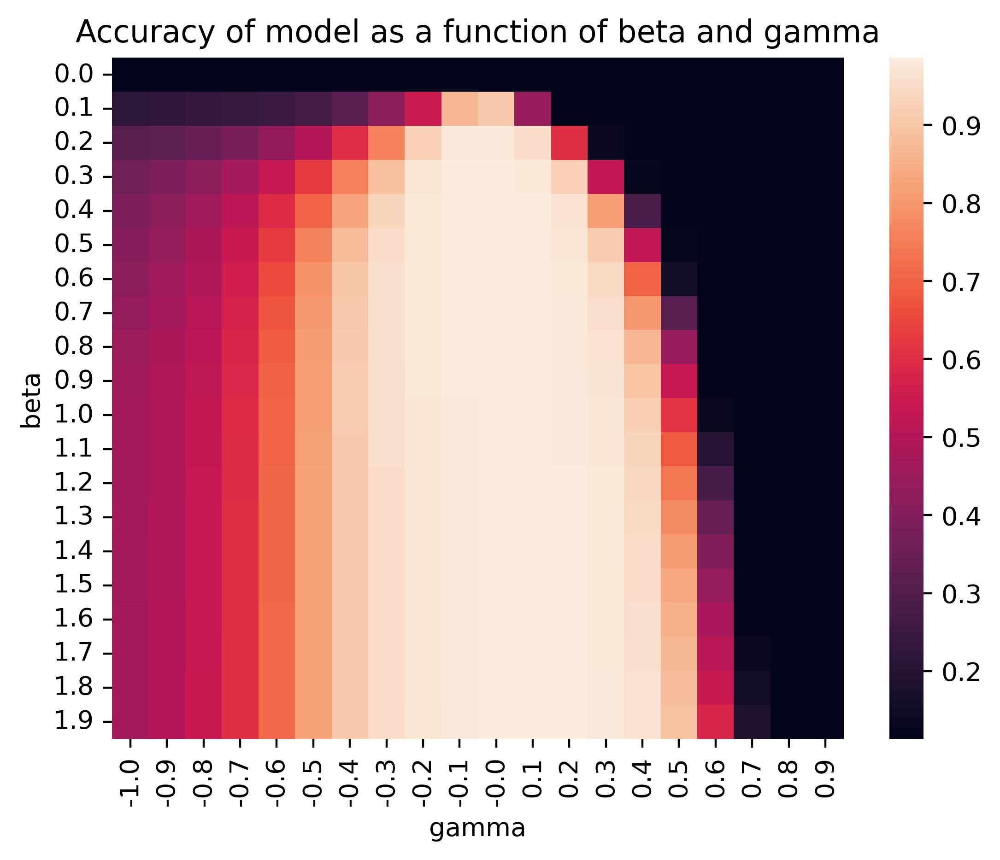
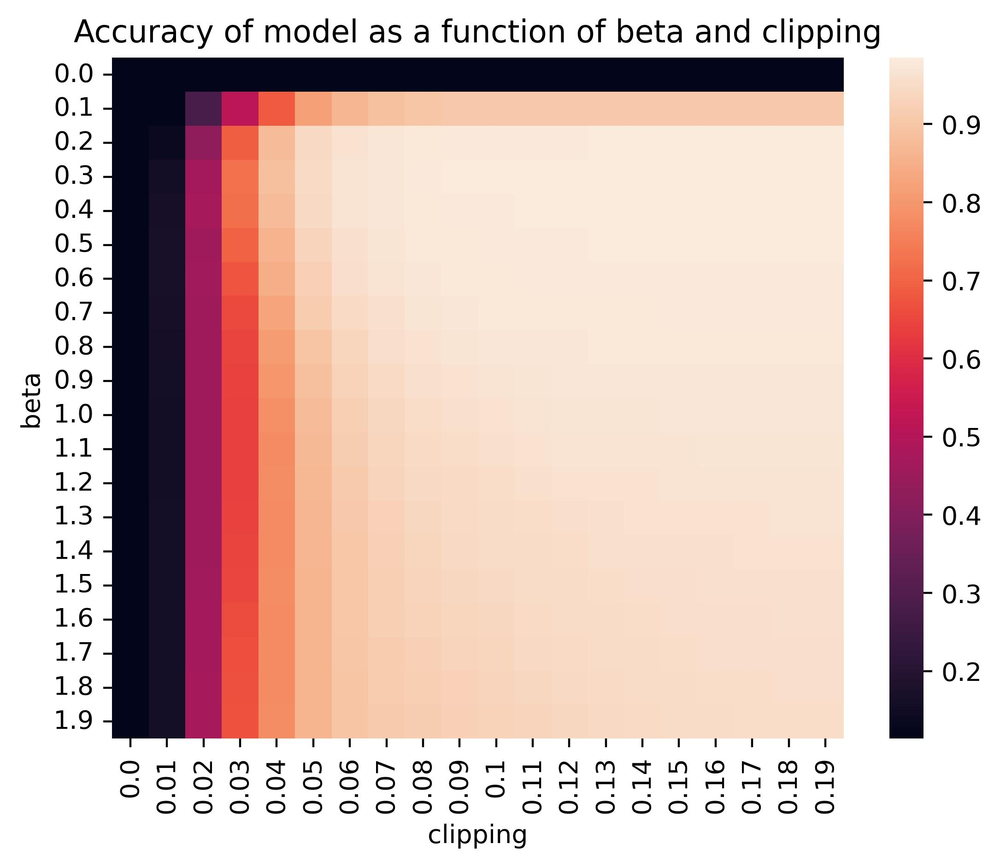
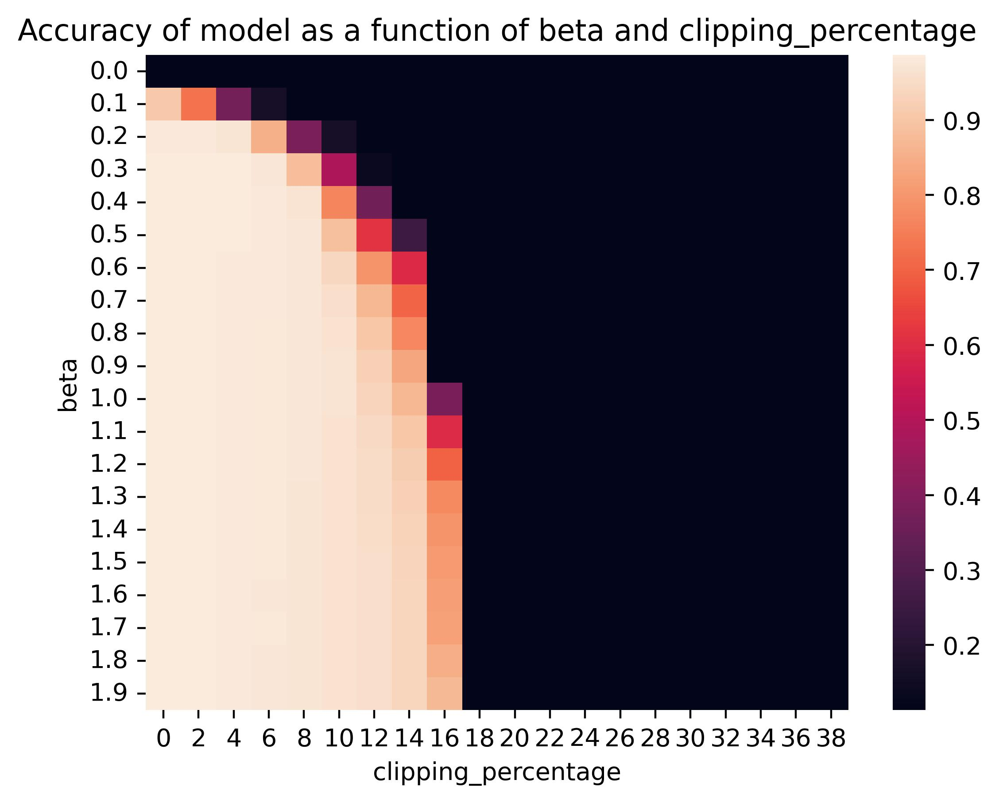
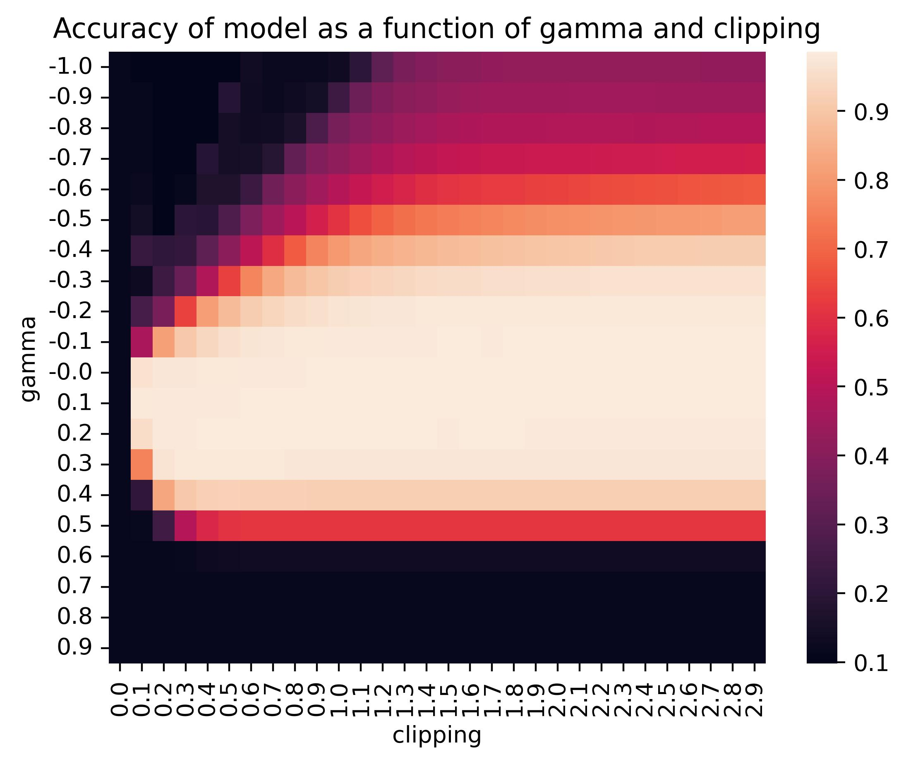
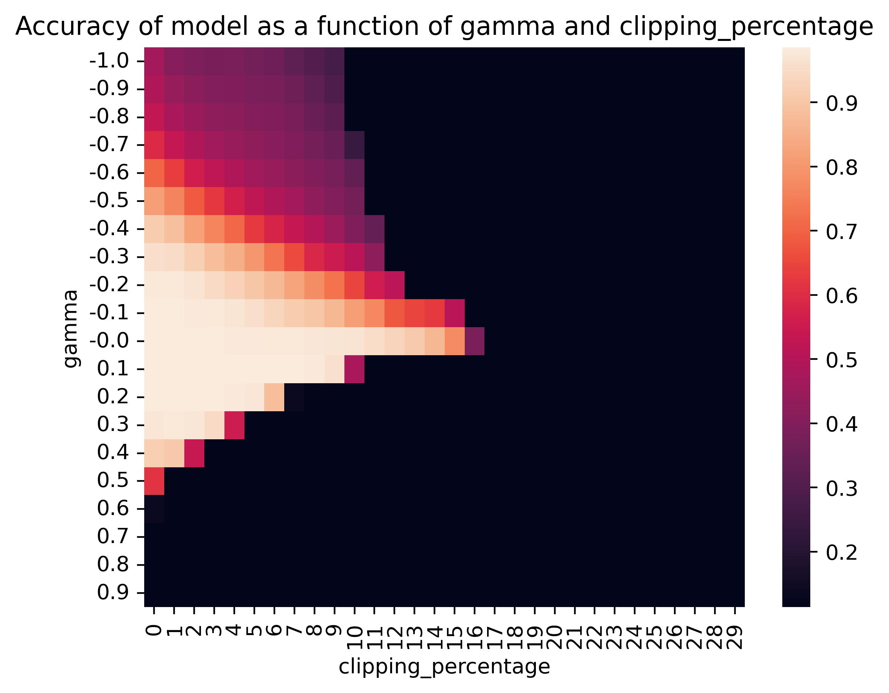
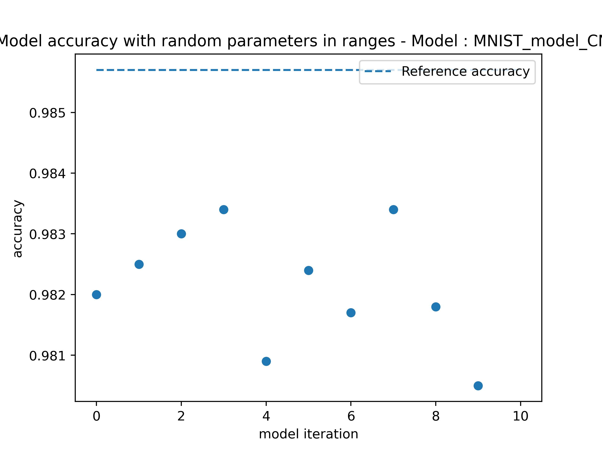

## **MNIST CNN Tests performed**

#### **Architecture of the model**

This model is a list of convolutional layers separated by ReLUs, and with a flatten layer at the end for the classification →  (C_32_3, **ReLU**, MaxPooling, C_32_3, **ReLU**, MaxPooling, Flatten, 10)
A layer of softmax is added at the end of the model.
________
#### **Parameter one by one**

In a first step, we studied the variation of the parameters one by one.
For this study, all ReLUs are changed by the same Custom ReLU where only one parameter changes. This allows to have an idea of the influence of the parameters. 

#### Beta variation only
We look at the influence of the beta parameter on the accuracy and loss of the model.

{:height="500px" width="500px" style="display: block; margin:auto"}

When beta < 1, there is not the same accuracy drop as for the MLP. 
 
When beta > 1, there is an overactivation of neurons. The ReLU has a linear part and since all the data are overactivated, the prediction remains the same. Softmax chooses the highest value so beta does not affect the accuracy. This may also be due to the fact that the network does not have many layers, a larger network might behave differently. However, we have an explosion of the loss due to this overactivation.

Unlike MLP the loss does not explode when beta increases. For small values of beta the loss is important

#### Gamma variation only
We look at the influence of the gamma parameter on the accuracy and loss of the model.

{:height="500px" width="500px"}

It is possible to vary gamma in a small interval around 0. This variation in gamma is directly related to the distribution of the data. We can see that a too high value for gamma will cancel the whole values and so the whole prediction will be 0 (which explains the 10 % accuracy).

#### Variation of clipping only
We look at the influence of the clipping parameter on the accuracy of the model.

{:height="500px" width="500px"}

Clipping value is not always consistent on every model and on every layer. We introduce a new parameter, clipping percentage, that clips a certain amount of maximum values after. 

#### Clipping percentage variation only

{:height="500px" width="500px"}

The choice of clipping percentage is more logical. It is still a clipping but it can be chosen in a more intelligent way and it fits better to the different models.
Quite intuitively, the higher the percentage of clipping, the lower the accuracy. Setting a maximum limit for the outputs leads to a loss of information for the prediction. 
Around 15% clipping we drop to a prediction of 0.1 constant which means that all values are at 0. We can deduce that for the CNN 85% of the values are less than or equal to 0. which also explains the very small possible gamma interval because the values at the output of the CNN layers are very small.

_____
#### **Parameter two by two**

In a second step, we studied the influence of the parameters between them.

#### Beta and gamma variation 
We tested the impact of both beta and gamma on accuracy of the model. 

{:height="500px" width="500px"}

  
We find a distribution in agreement with the graph of the previous tests. The variation of gamma and beta does not show any dependence. This is also explained by the fact that beta does not have a great influence on the accuracy when it is greater than 1 for this model, so we find especially the behavior of gamma which restricts the intervals in which we can use. 

#### Beta and clipping
We tested the impact of beta and clipping on accuracy.

{:height="500px" width="500px"}

  
There is a dependence between clipping and beta. But as the layer output values are very small this dependency is not visible. You would have to have very large beta values or very small clipping values for this to be noticed

#### Beta and clipping percentage
We tested the impact of beta and clipping percentage on accuracy.

{:height="500px" width="500px"}

  
The clipping percentage unlike normal clipping does not have this dependency on beta, so you can choose any beta greater than 1 as long as the percentage clipping is acceptable.

#### Gamma and clipping
We tested the impact of gamma and clipping on accuracy.

{:height="500px" width="500px"}

There is a dependency between gamma and clipping. Indeed, having a negative gamma makes the positive slope start for lower values. As a consequence, the clipping value is reached for lower values.

#### Gamma and clipping percentage
We tested the impact of gamma and clipping percentage on accuracy.

{:height="500px" width="500px"}

Just as beta and clipping percentage, we do not notice any abnormal behavior of the precision as a function of gamma and clipping percentage.
As long as clipping percentage is not too high, you can choose any gamma value around 0 and have a great accuracy. 

The general observation is that by using beta, gamma and clipping percentage, we have a superposition of optimal value intervals for accuracy
______
#### **Randomization**

#### Accuracy with random parameters
After testing the parameters two by two and showing the independence we have calculated the optimal range for a loss of accuracy of 1 % and an acceptable loss. We obtain an optimal range for each parameter :  
**Beta** : [0.12, 13.92]  
**Gamma** : [-0.27, 0.33]  
**Clipping percentage** : [0, 5.4]  

Based on these ranges, we created several models with parameters randomly chosen :  

{:height="500px" width="500px"}

  
Reference accuracy is the accuracy obtained with the test set for the classical ReLUs model.  

We can see that the loss of accuracy is really minimal while some range of values are relatively large. We can conclude that the modification of the ReLU function on an CNN with few layers is not a problem as long as the parameters are chosen in adequate ranges. The conflict between parameters is really minimal in our model.

