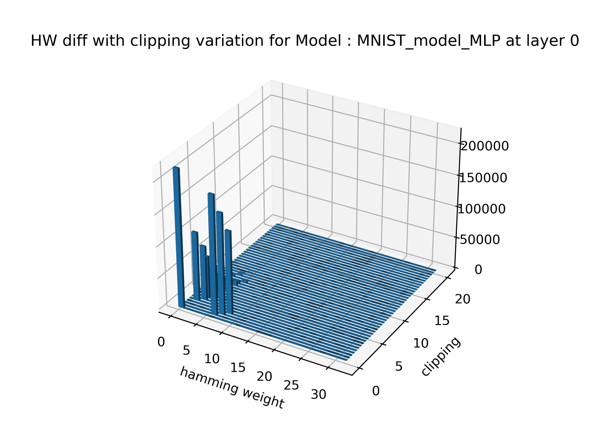

## **MNIST MLP Tests performed**

#### **Architecture of the model**

MNIST data are kept in the format (28,28,1) to simply switch to the [CNN on MNIST dataset](../CNN) model. This is why the list of layers starts with a flattening and continues with dense layers separated by ReLUs → (Flatten, 32, **ReLU**, 16, **ReLU**, 16, **ReLU**, 10).
A layer of softmax is added at the end of the model.
________
#### **Parameter one by one**

In a first step, we studied the variation of the parameters one by one.
For this study, all ReLUs are changed by the same Custom ReLU where only one parameter changes. This allows to have an idea of the influence of the parameters. 

#### Beta variation only
We look at the influence of the beta parameter on the accuracy and loss of the modes.

{:height="500px" width="500px" style="display: block; margin:auto"}

When beta < 0.4, the accuracy drops because the predictions are the same whatever the inputs. Bias terms become preponderant in the prediction and loss is constant equal to 2.5. The prediction is random.  

When beta is between 0.4 and 1, the loss decreases and the accuracy increases. 

When beta > 1, there is an overactivation of neurons. The ReLU has a linear part and since all the data are overactivated, the prediction remains the same. Softmax chooses the highest value so beta does not affect the accuracy. This may also be due to the fact that the network does not have many layers, a larger network might behave differently. However, we have an explosion of the loss due to this overactivation.

#### Gamma variation only
We look at the influence of the gamma parameter on the accuracy and loss of the model.

{:height="500px" width="500px"}

It is possible to vary gamma in a small interval around 0. This variation in gamma is directly related to the distribution of the data. We can see that a too high value for gamma will cancel the whole values and so the whole prediction will be 0 (which explains the 10 % accuracy).

#### Variation of clipping only
We look at the influence of the clipping parameter on the accuracy of the model.

{:height="500px" width="500px"}

Clipping value is not always consistent on every model and on every layer. We introduce a new parameter, clipping percentage, that clips a certain amount of maximum values after. 

#### Clipping percentage variation only

{:height="500px" width="500px"}

The choice of clipping percentage is more logical. It is still a clipping but it can be chosen in a more intelligent way and it fits better to the different models.
Quite intuitively, the higher the percentage of clipping, the lower the accuracy. Setting a maximum limit for the outputs leads to a loss of information for the prediction. 

_____
#### **Parameter two by two**

In a second step, we studied the influence of the parameters between them.

#### Beta and gamma variation 
We tested the impact of both beta and gamma on accuracy of the model. 

{:height="500px" width="500px"}

  
We find a distribution in agreement with the graph of the previous tests. The variation of gamma and beta does not show any dependence. This is also explained by the fact that beta does not have a great influence on the accuracy when it is greater than 1 for this model, so we find especially the behavior of gamma which restricts the intervals in which we can use. 

#### Beta and clipping
We tested the impact of beta and clipping on accuracy.

{:height="500px" width="500px"}

  
There is a dependence between clipping and beta. If beta increases, the clipping value will be reached more easily and many more values will be clipped. We have to choose a clipping according to beta and this can be a problem for the randomization of the function.

#### Beta and clipping percentage
We tested the impact of beta and clipping percentage on accuracy.

{:height="500px" width="500px"}

  
The clipping percentage unlike normal clipping does not have this dependency on beta, so you can choose any beta greater than 1 as long as the percentage clipping is acceptable.

#### Gamma and clipping
We tested the impact of gamma and clipping on accuracy.

{:height="500px" width="500px"}

There is a dependency between gamma and clipping. Indeed, having a negative gamma makes the positive slope start for lower values. As a consequence, the clipping value is reached for lower values.

#### Gamma and clipping percentage
We tested the impact of gamma and clipping percentage on accuracy.

{:height="500px" width="500px"}

Just as beta and clipping percentage, we do not notice any abnormal behavior of the precision as a function of gamma and clipping percentage.
As long as clipping percentage is not too high, you can choose any gamma value around 0 and have a great accuracy. 

The general observation is that by using beta, gamma and clipping percentage, we have a superposition of optimal value intervals for accuracy
______
#### **Randomization**

#### Accuracy with random parameters
After testing the parameters two by two and showing the independence we have calculated the optimal range for a loss of accuracy of 1 % and an acceptable loss. We obtain an optimal range for each parameter :  
**Beta** : [0.67, 3.5]  
**Gamma** : [-0.61, 0.49]  
**Clipping percentage** : [0, 7]  
Based on these ranges, we created several models with parameters randomly chosen :  

{:height="500px" width="500px"}

  
Reference accuracy is the accuracy obtained with the test set for the classical ReLUs model. 

We can see that the loss of accuracy is really minimal while some range of values are relatively large. We can conclude that the modification of the ReLU function on an MLP with few layers is not a problem as long as the parameters are chosen in adequate ranges. The conflict between parameters is really minimal in our model.

#### Hamming weight distribution with random parameters

Our study is based in a context of defense against side-channel attacks, so we have also studied the impact of our Custom ReLU on hamming weights of outputs. 

We have plotted the hamming weight distribution at the output of each layer for 10 models. Each model has a Custom ReLU with parameters randomly chosen in the previous ones. This Custom ReLU is applied to each layer and changes for each model. 
We also plotted the difference of this distribution with a reference model which has only normal ReLUs.

{:height="300px" width="300px"}
{:height="300px" width="300px"}
{:height="300px" width="300px"}

At first glance, we don't see any impact on the distribution. However, by looking more precisely the difference between distributions, there is an impact that could bother the attacker.

_______
#### **Hamming Weight**
We also studied in parallel the impact of the parameters on hamming weights. 

#### *Hamming Weight Distribution*
First, we studied the impact of each parameter on the hamming wieght distribution at the output of each layer. 
We also made the difference of this distribution with the distribution of a normal ReLU. 
For all tests, only one parameter is varied and the same Custom ReLU is applied to each layer.
#### Beta
We have plotted the hamming weight distribution as a function of beta for the MLP as well as the difference of this distribution with the reference model having a normal ReLU.

{:height="300px" width="300px"}
{:height="300px" width="300px"}
{:height="300px" width="300px"}

#### Gamma
We have plotted the hamming weight distribution as a function of gamma for the MLP as well as the difference of this distribution with the reference model having a normal ReLU.

{:height="300px" width="300px"}
{:height="300px" width="300px"}
{:height="300px" width="300px"}

#### Clipping
We have plotted the hamming weight distribution as a function of clipping for the MLP as well as the difference of this distribution with the reference model having a normal ReLU.

{:height="300px" width="300px"}
{:height="300px" width="300px"}
{:height="300px" width="300px"}

#### *Hamming Weight Difference*
We tried to see the impact of hamming weight directly on the output of the neurons. To do this, we looked at the hamming weight at the output of each neuron with a Custom ReLU and compared it with the expected one. Then, we plot the distribution of these different hamming weights. For all tests, only one parameter is varied and the same Custom ReLU is applied to each layer.

Beta and gamma study did not give conclusive results on this part.

#### Clipping

{:height="300px" width="300px"}
{:height="300px" width="300px"}
{:height="300px" width="300px"}

We see that the main difference is at a level of clipping values, which is logical. Note, however, that a difference at layer 0 also leads to greater differences at layers 1 and 2. It is therefore, important to pay attention to this repercussion for larger models.
From a cybersecurity point of view, there is an interest because these modified hamming weights can lead the attacker to false assumptions and thus make the attack much too long to be interesting. 
