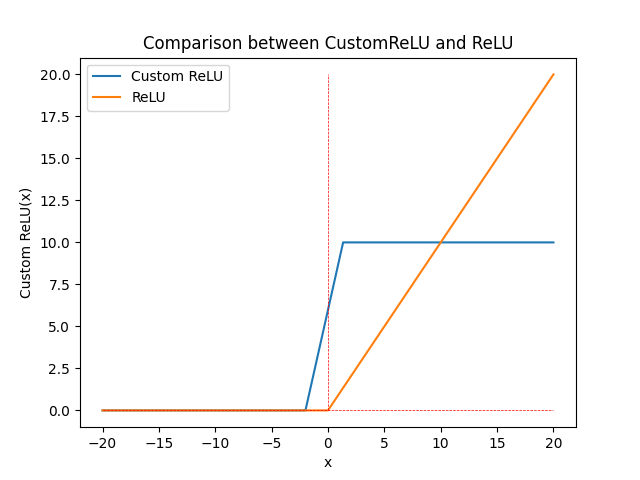

# Evaluation of Custom ReLU function 

In order to define possible countermeasures preventing Model Extraction using Side-Channel attacks, modifying widespread activation function ReLU during inference can be an intresting track. In order to ensure that it is a viable protection, evaluating its impact over model accuracy in different configurations is compulsory. 

## Python scripts and Jupyter Notebook

Four proposed scripts constitute a first version of the assessment tool.
Globally, these scripts allow to train a reference model with a specified list of layers through the TensorFlow API. Then generate a copy of this reference model with ReLU functions replaced by its custom version. Different configurations can be tested regarding Custom ReLU layer's parameters to compare accuracy of the modified model to the reference one.

So far, scripts are organised as follows : 

- [FinalTests.ipynb](FinalTests.ipynb) : It contains all functions allowing to perform tests on differents models and to see the computed results.

- [Test_functions.py](Test_functions.py) : All testing functions are defined here. They allow to plot, compute and update models characteristics for tests. Many of the functions defined here are not necessarily used in Jupyter Notebook. Feel free to test them.

- [Models.py](Models.py) : This includes the Training Model and Testing Model classes that are inherited which are classes inherited from the Model class of Tensorflow. It allows to train a reference model using the Training Model class and to test it using the Testing Model class that replaces all ReLUs by CustomReLUs. 

- [CustomReLU.py](CustomReLU.py) : It contains the definitions of modified versions of ReLU. It is mainly used to plot CustomReLUs as a function of their parameters.

- [Config.py](Config.py) : It is a configuration file for the different models that are tested. It contains the different ranges for parameters that are used in those tests.

The CIFAR10 and MNIST folders contain the images generated during model tests on these datasets. They also contain the .h5 files with models weights. 
## Parameters study
The study is performed on three models with following layers and dataset :
* [MLP on MNIST dataset](MNIST/MLP)  → (Flatten, 32, **ReLU**, 16, **ReLU**, 16, **ReLU**, 10) 
* [CNN on MNIST dataset](MNIST/CNN)  → (C_32_3, **ReLU**, MaxPooling, C_32_3, **ReLU**, MaxPooling, Flatten, 10)
* [CNN on CIFAR-10 dataset](CIFAR10/CNN)  → (C_32_3, **ReLU**, MaxPooling, C_64_3, **ReLU**, MaxPooling, C_128_3, **ReLU**, MaxPooling, Flatten, 512, 10)

Each **ReLU** is replaced by a **Custom ReLU** whose parameters ***beta*** (positive slope), ***gamma*** (non-linearity point), ***clipping*** (maximum value) are modified. 
Here is a comparison between classic ReLU and a CustomReLU with parameters beta = 3, gamma = -2 and clipping = 10.  

{:height="700px" width="700px"}

## **Tests performed**

For each model, we performed specific tests on its parameters to observe the overall impact on accuracy and loss. 

In a first step, we studied the variation of the parameters one by one on each model. 
For this study, all ReLU's are replaced by the same Custom ReLU where only one parameter changes. This allows to have an idea of the influence of a single parameter over the model's accuracy. 

### **Parameter one by one**
* Beta variation only
* Gamma variation only
* Clipping variation only
* Clipping percentage only

In a second step, we varied the parameters in groups of two to observe the interaction between them. It allows to have heat maps on the accuracy of the model.

### **Parameter two by two**
* Beta and gamma variation
* Beta and clipping variation 
* Beta and clipping percentage variation 
* Gamma and clipping variation
* Gamma and clipping percentage variation 

### **Computing ranges**
We have, after analysis of the heatmaps, that the parameters beta, gamma and clipping percentage had no influence on each other for the accuracy. Indeed, the maximum accuracy on the heatmaps correspond perfectly to the maximum accuracy obtained for the parameters one by one. 

For this reason, we chose to make an algorithm of selection of an optimal interval for the parameters one by one.

By choosing an allowed loss of precision, you can define a range of values in which to choose your parameter. 
The algorithm starts at the values of the classical ReLU (beta = 1, gamma = 0, clipping = + ∞) then progressively decreases a parameter to find its min limit then increases it to find its max limit. 

### **Generating models with random parameters**
Once the optimal intervals are defined, we choose the parameters in these intervals using a normal distribution. 
This allows us to update the Custom ReLUs of each model and to make new predictions with these new parameter values. 
It is then observed whether the accuracy decreases according to the allowed loss of precision.

* Update of the custom ReLUs of the model after using the entire test dataset and comparison on 10 iterations
* Update of the custom ReLUs of the model after each inference

### **Hamming weights**

The case of hamming weights is more complex. Due to limited computational power and memory, we have tested the variation of output distributions according to their representation in hamming weights only on the [MLP model on MNIST](MNIST/MLP).

* Distribution of hamming weights for models with random parameters and comparison with the reference model
* Distribution of hamming weights by varying each parameter one by one
* Distribution of the difference between ReLU and CustomReLUs in hamming weights neuron by neuron

 

